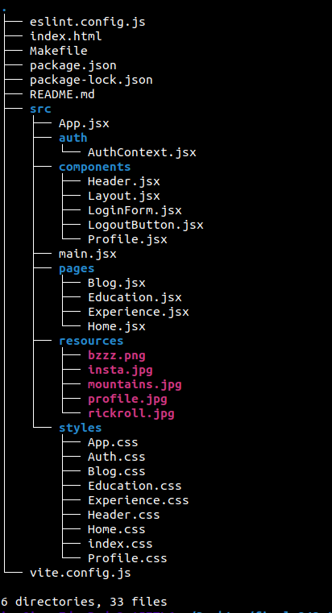

# CS343 Project 1
**Author:** Ian du Toit  
**Student Number:** 27049744  

---

## Screenshot

---

## AI Use
- I used ChatGPT to help me figure out some core concepts like the use of browser local storage.  
- I used ChatGPT to help me figure out what to put in the Makefile.  
- **All code is my own, none of it comes from any A.I. models.**

---

## Website Setup & Usage
To run the website:  
1. `cd` into the **27049744-rw343-project1** directory.  
2. Open a terminal and run:  
   `make setup`  
3. In the same directory, run:  
   `make dev`  
4. Open the link it provides to view the website in your browser using Node.js.
5. To login, the username is admin and the password is letmein
6. Although you should see this in grey placeholder text in the input box when you login

---

## Requirements
- **Node.js** is required to run the website.  
- Install Node.js on Linux:  
  `sudo apt install nodejs npm -y`  
- Run `make setup` to install dependencies.  
- `make setup` checks the **package.json** file for dependencies automatically.  

---

## Sources
- [HTML & CSS Full Course for Free - Bro Code (YouTube)](https://www.youtube.com/watch?v=HGTJBPNC-Gw&list=PLZPZq0r_RZOPP5Yjt6IqgytMRY5uLt4y3&ab_channel=BroCode)  
- [JavaScript Full Course for Free - Bro Code (YouTube)](https://www.youtube.com/watch?v=lfmg-EJ8gm4&list=PLZPZq0r_RZOPP5Yjt6IqgytMRY5uLt4y3&index=2&ab_channel=BroCode)  
- [React Full Course for Free - Bro Code (YouTube)](https://www.youtube.com/watch?v=CgkZ7MvWUAA&list=PLZPZq0r_RZOPP5Yjt6IqgytMRY5uLt4y3&index=3&ab_channel=BroCode)  
- [What is React Router? (W3Schools)](https://www.w3schools.com/react/react_router.asp)  
- [Vite.js: A Beginner's Guide](https://betterstack.com/community/guides/scaling-nodejs/vitejs-explained/)  
- [useContext – React Documentation](https://react.dev/reference/react/useContext?utm_source=chatgpt.com)  
- [FileReader – MDN Docs](https://developer.mozilla.org/en-US/docs/Web/API/FileReader?utm_source=chatgpt.com)  
- [Window: localStorage – MDN Docs](https://developer.mozilla.org/en-US/docs/Web/API/Window/localStorage?utm_source=chatgpt.com)  
- [Managing State – React Documentation](https://react.dev/learn/managing-state)  
- [React State (W3Schools)](https://www.w3schools.com/react/react_state.asp)  
